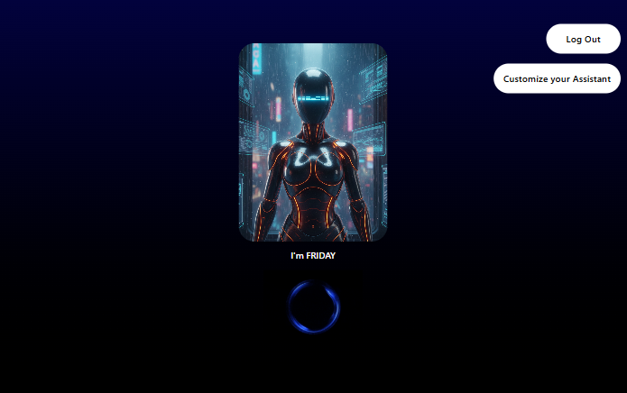

# 🧑‍💻 Virtual AI Voice Assistant

An **AI-powered virtual assistant** built with **React, Node.js, Express, MongoDB, and Groq AI**.  
It can **listen to your voice, respond with speech (US accent),Talk to you like a friend, answer complex questions, answer general questions, and more.**  

---

## 📑 Table of Contents
1. [Features](#-features)
2. [Tech Stack](#-tech-stack)
3. [Installation & Setup](#-installation--setup)
4. [Environment Variables](#-environment-variables)
5. [Getting API Keys](#-getting-api-keys)
   - [Groq API Key](#-1-gemini-api-key)
6. [Usage](#-usage)
7. [Screenshots](#-screenshots)
8. [Future Improvements](#-future-improvements)
9. [Author](#-author)

---

## ✨ Features
- 🎙️ **Voice recognition** using Web Speech API  
- 🗣️ **Text-to-Speech (US accent)** for smooth conversations  
- 🤖 **AI-powered responses** using **Groq AI**  
- 🔍 **Smart actions**:
  - Real Time information   
  - High Accuracy  
  - Calculator  
  - etc
- 🖼️ **Customizable Assistant Profile** (name + avatar)  
- 📝 **User history tracking** stored in MongoDB  
- 🔑 **Authentication & Security** with JWT and bcrypt  

---

## 🛠 Tech Stack

**Frontend**
- React 19  
- React Router DOM  
- Tailwind CSS 4  
- Axios  

**Backend**
- Node.js + Express 5  
- MongoDB + Mongoose  
- JWT for authentication  
- bcryptjs for password hashing  
- Groq AI (Generative Language API)  
- Moment.js for date handling  

---

---

## ⚙️ Installation & Setup

### 1️⃣ Clone the Repository
```bash
git clone https://github.com/Balamurugan66-code/AI-Voice-Assistant-VA.git
cd AI-Voice-Assistant-VA
```

### 2️⃣ Setup Backend
```bash
cd backend
npm install
```

### 3️⃣ Setup Frontend
```bash
cd ../frontend
npm install
```

---

## 🌍 Environment Variables

You need to configure environment variables for both **backend** and **frontend**.  

1. Inside `backend/`, create a `.env.example` file:
```env
PORT=5000
MONGO_URI=your_mongo_connection_string
JWT_SECRET=your_secret_key
GROQ_API_KEY=your_groq_api_key_here

```

2. Copy `.env.example` to `.env`:
```bash
cp .env.example .env
```

3. Fill in your actual credentials in `.env`.  

---

## 🔑 Getting API Keys

### 🔹 1. Groq API Key
1. Go to 👉 https://console.groq.com
2. Sign up / login
3. Go to API Keys section
4. Click Create API Key
5. Copy and paste into .env:  
   ```env
   GROQ_API_KEY=your_generated_key_here
   ```

---

---

## 🚀 Usage

### Run Backend
```bash
cd backend
npx nodemon
```

### Run Frontend
```bash
cd frontend
npm run dev
```

- Frontend: [http://localhost:5173](http://localhost:5173)  
- Backend: [http://localhost:5000](http://localhost:5000)

---

## 📸 Screenshots

### User SignIn Page


### Virtual Assistant


---

##✨Features
- 🎤 Voice input using Web Speech API
- 🤖 AI-powered responses using Groq API
- 🔊 Text-to-speech output
- 🔐 Secure user authentication (JWT + MongoDB)
- ⚡ Real-time interaction with low latency
- 🎨 Customizable assistant interface

---

## 📌 Future Improvements
- 🌎 Multi-language support  
- 🎵 Spotify/YouTube Music integration  
- 📅 Task Automation & reminders  
- 💻 Desktop app version with Electron  

---

## 👨‍💻 Author
**Balamurugan B**  
Built with ❤️ using MERN + Groq AI  
